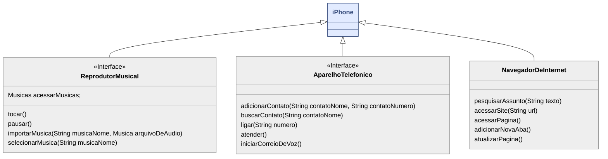

# UmlIphone-DIO
Este projeto nasceu a partir dos estudos na DIO, com foco em Programação Orientada a Objetos (OOP). A proposta é simples, mas poderosa: demonstrar como uma única interface pode ser versátil, atribuindo múltiplas funcionalidades a um mesmo objeto — neste caso, inspirado no conceito de um "iPhone" universal. A ideia é mostrar como, com boas práticas de modelagem, conseguimos escalar, reutilizar e adaptar estruturas com facilidade.

Neste contexto, a UML (Unified Modeling Language) se revela uma ferramenta essencial para arquitetar sistemas robustos e bem planejados. Aqui estão alguns dos principais benefícios do uso de UML:

- Clareza na Comunicação: Facilita a comunicação entre desenvolvedores, analistas e stakeholders, pois traduz ideias abstratas em representações visuais compreensíveis.

- Organização e Planejamento: Permite visualizar a estrutura e o comportamento do sistema antes mesmo de escrever uma linha de código, o que ajuda a prever gargalos e melhorar o design.

- Reutilização e Escalabilidade: Torna mais fácil identificar padrões reutilizáveis e promover a escalabilidade do software com base em componentes bem definidos.

- Pensamento Abstrato e Modular: Estimula a criação de sistemas desacoplados e orientados a responsabilidades específicas (como o princípio SOLID), com foco em interfaces bem definidas.

- Base para Implementação: Serve como guia direto para implementação, especialmente útil em equipes maiores ou com integração contínua entre modelagem e desenvolvimento.

Este projeto é apenas um exemplo didático, mas demonstra como a modelagem com UML pode ser o primeiro passo para transformar uma boa ideia em um sistema real, sólido e sustentável.

### Diagrama UML (Mermaid)

