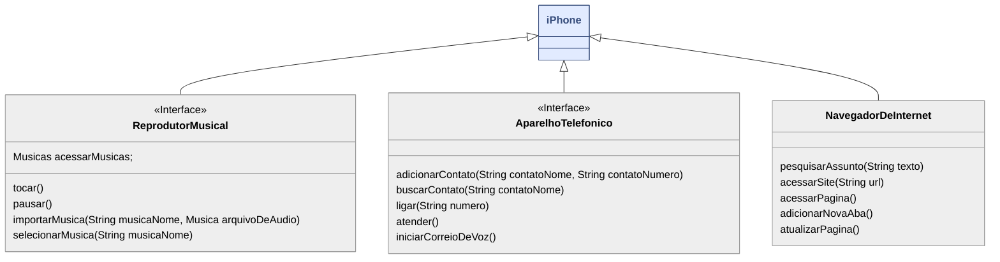

# UmlIphone-DIO

> PT-BR:

Este projeto nasceu a partir dos estudos na DIO, com foco em Programação Orientada a Objetos (OOP). A proposta é simples, mas poderosa: demonstrar como uma única interface pode ser versátil, atribuindo múltiplas funcionalidades a um mesmo objeto — neste caso, inspirado no conceito de um "iPhone" universal. A ideia é mostrar como, com boas práticas de modelagem, conseguimos escalar, reutilizar e adaptar estruturas com facilidade.

Neste contexto, a UML (Unified Modeling Language) se revela uma ferramenta essencial para arquitetar sistemas robustos e bem planejados. Aqui estão alguns dos principais benefícios do uso de UML:

- Clareza na Comunicação: Facilita a comunicação entre desenvolvedores, analistas e stakeholders, pois traduz ideias abstratas em representações visuais compreensíveis.

- Organização e Planejamento: Permite visualizar a estrutura e o comportamento do sistema antes mesmo de escrever uma linha de código, o que ajuda a prever gargalos e melhorar o design.

- Reutilização e Escalabilidade: Torna mais fácil identificar padrões reutilizáveis e promover a escalabilidade do software com base em componentes bem definidos.

- Pensamento Abstrato e Modular: Estimula a criação de sistemas desacoplados e orientados a responsabilidades específicas (como o princípio SOLID), com foco em interfaces bem definidas.

- Base para Implementação: Serve como guia direto para implementação, especialmente útil em equipes maiores ou com integração contínua entre modelagem e desenvolvimento.

Este projeto é apenas um exemplo didático, mas demonstra como a modelagem com UML pode ser o primeiro passo para transformar uma boa ideia em um sistema real, sólido e sustentável.

> EN-US:

This project was born from studies at DIO, focusing on Object-Oriented Programming (OOP). The proposal is simple but powerful: to demonstrate how a single interface can be versatile, assigning multiple functionalities to the same object — in this case, inspired by the concept of a universal "iPhone". The idea is to show how, with good modeling practices, we can scale, reuse and adapt structures easily.

In this context, UML (Unified Modeling Language) proves to be an essential tool for architecting robust and well-planned systems. Here are some of the main benefits of using UML:

- Clarity in Communication: Facilitates communication between developers, analysts and stakeholders, as it translates abstract ideas into understandable visual representations.

- Organization and Planning: Allows you to visualize the structure and behavior of the system before even writing a line of code, which helps to predict bottlenecks and improve the design.

- Reuse and Scalability: Makes it easier to identify reusable patterns and promote software scalability based on well-defined components.

- Abstract and Modular Thinking: Encourages the creation of decoupled systems oriented to specific responsibilities (such as the SOLID principle), with a focus on well-defined interfaces.

- Basis for Implementation: Serves as a direct guide for implementation, especially useful in larger teams or with continuous integration between modeling and development.

This project is just a didactic example, but it demonstrates how modeling with UML can be the first step to transform a good idea into a real, solid and sustainable system.

### Diagrama UML (Mermaid)

